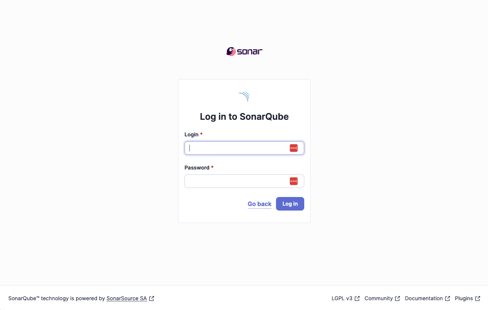

# Introduction

We have integrated the build with the Sonar static analysis tools to gain information on code coverage, code quality, and other metrics.

# Running Sonarqube locally

To run a local development copy of Sonar, you will need to have Docker installed on your machine. You can run the following command to start a local instance of Sonar:

```shell
docker run -d --name sonarqube -p 9000:9000 sonarqube
```

This starts the latest version of sonarqube in a container named `sonarqube` and exposes it on port 9000.
It takes a couple of minutes to become available after running the command.
When it is ready, the logs will show `SonarQube is operational`.

# Setting up Sonar

Navigate to [http://localhost:9000](http://localhost:9000) in your browser and login with the default credentials `admin`/`admin`.



You will be prompted to change the default password.
After changing the password, you will be taken to the empty Sonar dashboard.


Click "Create a local project", and give it the name and key of `check-ins`.
Then click `Next`, select `Use the Global setting`, and then click `Create Project`.


Choose `Locally` for the analysis method, then on the next screen click `Generate` to create a token.
Then select `Gradle` as the build description and you will be presented with the command to run the analysis.


Copy the command to your clipboard, and run it in a terminal in the checkins project directory.

```shell
❯ ./gradlew sonar \
  -Dsonar.projectKey=check-ins \
  -Dsonar.projectName='check-ins' \
  -Dsonar.host.url=http://localhost:9000 \
  -Dsonar.token=<<token>>

...snip...

...runs all the tests...

BUILD SUCCESSFUL in 4m 27s
13 actionable tasks: 8 executed, 5 up-to-date
```

And the browser will then show the results of the analysis.


# Actioning the results

## Issues

Some results will be actual issues that should be fixed, more are likely false positives.
False positives can be annotated in the source with something similar to:

```java
@SuppressWarnings("java:S116") // All caps naming makes the code here easier to read 
```

The comment helps people understand what the suppression was addressing, as otherwise it may not be clear when it can be removed when and if the code changes.

Multiple suppressions can be added on different lines with comments and a trailing comma:

```java
@SuppressWarnings({
        "java:S116", // All caps naming makes the code here easier to read
        "java:S117", // Some other comment about this suppression
}) 
```

## Security Hotspots

Security hotspots are areas of the code that may be vulnerable to attack.
These should be reviewed and fixed as necessary.
False positives are also possible here.

## Coverage
Coverage should not been seen as a 100% target.
To get to 100%, you need to write brittle tests that have prior knowledge of the internal machinery or make use of excessive mocking.
In my experience, more than 70% coverage is a good target to aim for.